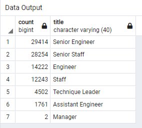

# Pewlett-Hackard-Analysis

## Overview of the analysis
##### The purpose of the anaslysis was to determine the number of employees at Pewlett-Hackard that would be eligible for retirement within a couple of years; to determine their titles/positions and spread across the departments; and also to view the workabity of a mentorship program that would prepare newer staff to fill the pending vacant positions.

## Results

* The number of rows in the retirement_titles table show that a total of 90398 personnel are eligible for retirement within a couple of years. This translates to almost 1 in every 3 of the 300024 workers at Pewlett-Hackard. 
* The retiring_titles table shows that of the 90398 soon to be eligible for retirement, 57668 are either Senior Engineer, or Senior Staff. Again, almost 1 in every 3 soon to be eligible for retirement. (see the figure below).
.
* Most of the personnel that would be retiring hold senior positions in the company.
* Majority of the soon-retiring personnel are eligible for a mentorship program where they can oversee a younger staff stepping into their role while they watchon-on and let the staff build confidence in the role.

## Summary
The analysis has shown that a large proportion of staff at Pewlett-Hackard are soon due for retirement and this could have a major impact on the company if appropriate steps are not taken to mitigate the impact. The analysis also shows that a mentorship program could be successfully implemented to mitigate the impact of high retirement numbers. Another table could have been created to show the spread of retiring workers across departments and also another table to show how many managers would also be due for retirement soon.